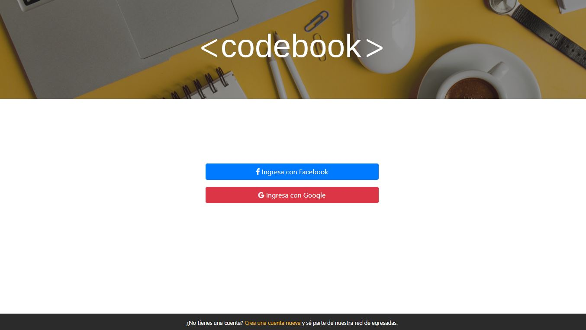

# PRODUCTO FINAL - SPRINT 3

## Crea tu Propia Red Social

* Para este proyecto se nos solicitó que desarrollemos una red social de nuestra preferencia empleando los conocimientos adquiridos hasta ahora en el bootcamp de Laboratoria-Lima

* El producto elegido para desarrollar fue una red social exclusiva para egresadas de Laboratoria a la que llamamos **CodeBook**.

* Trabajamos en parejas y como parte del proceso de creación ideamos los siguientes prototipos para el producto: 

* A continuación, las vistas del producto entregado:

* Sobre los conocimientos adquiridos puestos en práctica:

1. Empleamos la librería de **jquery**.

2. Escogimos **Bootstrap 4** como framework.

3. Empleamos **Firebase** para la autenticación de usuarios.

* Integrantes:
ANDREA y LUCERO

